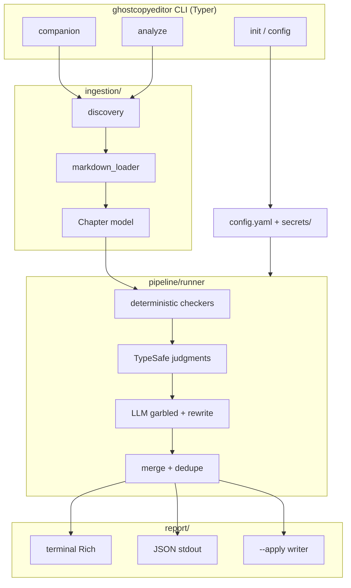

# GhostCopyeditor v1 — System Design

| Field | Value |
|-------|-------|
| **Author** | _(agent)_ |
| **Date** | 2026-09-21 |
| **Status** | Draft |
| **Project** | `C:\Users\shinr\projects\GhostCopyeditor` |
| **Blueprint** | `C:\Users\shinr\projects\Ghostreader` |
| **Audience** | Implementers landing incremental commits on `master` |

---

## Overview

GhostCopyeditor is the missing **copy editor** in Shinran's Ghost writing suite. Ghostwriter drafts scenes. Autonomicon runs the novel loop. Ghostreader checks continuity and literary craft. GhostCopyeditor checks grammar and mechanics, garbled or broken sentences, style consistency, and light wordiness or echo. It does **not** own continuity or craft.

v1 is a **Ghostreader twin**: a separate Python package (`ghostcopyeditor`) with Typer CLI, Rich output, `config.yaml`, and `secrets/` habits copied from Ghostreader. There is **no shared library** in v1. Autonomicon will call `ghostcopyeditor companion` between chapters (same subprocess shape as today's Ghostreader hook) and may call `analyze` on a finished chapter folder.

The pipeline is fixed: **ingest → deterministic checkers → TypeSafe judgments → LLM garbled/rewrite suggestions → terminal + JSON report**. Optional `--apply` writes only whitelisted deterministic fixes. Successful runs always exit `0`; Autonomicon decides what findings mean.

This design maps one-to-one onto the six pending xbrief scopes under `xbrief/pending/`.

---

## Background & Motivation

### Current state

| Sister | Role | Autonomicon touchpoint |
|--------|------|------------------------|
| Ghostwriter | Writes fiction scenes | Called inside the pipeline |
| Autonomicon | Concept → publishing loop | SoT for timeline/state |
| Ghostreader | Continuity + craft | Opt-in `ghostreader companion --format json` via `src/autonomicon/integrations/ghostreader_companion.py` |
| GhostCopyeditor | Copy edit | **Missing** (this project) |

Autonomicon already has an in-agent "precision copy editor" prompt in `src/autonomicon/agents/editor.py`, but there is no sister CLI Autonomicon can invoke the way it invokes Ghostreader. Operators want a dedicated, testable, Autonomicon-callable tool with a stable JSON contract.

### Pain points this solves

1. **No Autonomicon-callable copy-edit gate** between chapters (Ghostreader covers continuity/craft only).
2. **No deterministic-first path** for safe, cheap fixes before spending TypeSafe/LLM budget.
3. **No `--apply` with a hard safety boundary** (LLM rewrites must stay suggestions in v1).
4. **Greenfield package** needs an explicit twin layout so Autonomicon resolution (`PATH`, bin override, sibling `uv run --project`) can mirror Ghostreader without inventing a new integration shape.

### Authoritative product constraints

From `xbrief/PROJECT-DEFINITION.xbrief.json` KeyDecisions and the setup interview (locked):

- Blueprint = Ghostreader twin (separate package; no shared lib in v1)
- Modes = `companion` + `analyze`
- Inputs = Markdown chapters / chapter folders only
- Findings = grammar, garbled, style, wordiness/echo
- Engines = deterministic → TypeSafe → LLM
- Outputs = terminal + JSON; exit always 0 on success
- Apply = deterministic-only, optional
- Novel mode = chapter-by-chapter with one combined report
- Python 3.12+; coverage ≥ 85%; trunk-based on `master`

---

## Goals & Non-Goals

### Goals

1. Ship a Typer CLI Autonomicon can call non-interactively (`companion` for one chapter; `analyze` for a folder).
2. Emit a **stable JSON schema** on stdout when `--format json` (progress/warnings on stderr).
3. Catch grammar/mechanics, garbled/broken sentences, style consistency, and light wordiness/echo.
4. Run engines in order with clear Finding provenance (`engine` field).
5. Support optional `--apply` for **safe deterministic fixes only**.
6. Always exit `0` on successful completion even when findings exist.
7. Meet ≥ 85% coverage overall and per module; secrets only under `secrets/`.
8. Land as six incremental, reviewable units matching the pending xbriefs.

### Non-Goals (v1)

- Continuity, plot holes, character knowledge, foreshadowing (Ghostreader).
- Craft scoring, prose "strength" ratings, literary quality essays (Ghostreader).
- EPUB / plain `.txt` ingest.
- Shared `ghostcommon` package.
- Applying TypeSafe or LLM suggestions via `--apply`.
- LanceDB / embeddings / LangGraph analysis graph (Ghostreader-heavy stack).
- Interactive chat or compare commands.
- Hard-fail exit codes for findings (no Ghostreader-style `--fail-on-continuity` exit 2 in v1).
- Autonomicon integration PR inside the Autonomicon repo (document the contract only; hook lands later).

---

## Proposed Design

### High-level architecture



### Package layout (Ghostreader twin, thinner)

Mirror Ghostreader naming where it helps Autonomicon operators. Drop analyze-graph / LanceDB / EPUB.

```text
GhostCopyeditor/
  pyproject.toml
  config.yaml                 # created by init; also ship a commented default in save()
  secrets/
    llm.example               # tracked
    llm.env                   # gitignored
  ghostcopyeditor/
    __init__.py               # __version__ = "0.1.0"
    cli.py                    # Typer app: init, companion, analyze, config
    config.py                 # GhostCopyeditorConfig (pydantic.BaseModel + commented YAML save)
    paths.py                  # project root, secrets, .ghostcopyeditor state
    llm.py                    # load_secrets early (PR1); get_llm/stub later (PR5)
    models/
      finding.py              # Finding, Location, enums
      report.py               # CopyEditReport + summary helpers
    ingestion/
      __init__.py             # Chapter dataclass
      markdown_loader.py      # single .md or chapter-*.md folder
      discovery.py            # companion vs analyze path resolution
    checkers/
      __init__.py             # Checker protocol + registry
      mechanics.py            # grammar/mechanics deterministic rules
      style.py                # style consistency hooks
      wordiness.py            # conservative phrase replacements
      echo.py                 # light local echo heuristic
      apply.py                # safe apply writer
    typesafe/
      __init__.py
      client.py               # ensure_sdk, ensure_api_key, ask()
      routing.py              # resolve_typesafe_enabled, confidence floor
      questions.py            # copy-edit Choice/Noul bank
      adapters.py             # TypeSafe response → Finding
    llm_engine/
      __init__.py
      garbled.py              # detect nonsense / mid-edit wreckage
      prompts.py              # system/user prompt templates + JSON schema
    pipeline/
      __init__.py
      runner.py               # run_chapter_pipeline / run_analyze_pipeline
    commands/
      companion.py            # thin orchestrator (like GR commands/companion.py)
      analyze.py
    report/
      __init__.py
      terminal.py
      json_export.py
  tests/
    ...
```

State directory (reports only; no vector DB). **Intentional divergence from Ghostreader:** GR nests companion briefs under `.ghostreader/<story>/companion/reports/`. GhostCopyeditor uses a flatter tree:

```text
.ghostcopyeditor/<story-slug>/reports/companion-ch018.json
.ghostcopyeditor/<story-slug>/reports/analyze-YYYYMMDD-HHMMSS.json
```

`story_slug` = filesystem slug of `_skip_generic_parents(path.parent)` for a `chapter-NNN.md` file (same skip set as Ghostreader: `chapters`, `manuscript`, `manuscripts`, `content`, `text`, `docs`, `src`). For `analyze` on a chapters directory, slug the skipped parent of that directory. Do **not** nest per-chapter state segments (`chapter-018/`) under `.ghostcopyeditor/` in v1.

Path resolution copies Ghostreader's `paths.py` habits: walk up for `config.yaml`, fall back to package checkout root (Autonomicon foreign CWD), skip generic parents, require `chapter-NNN.md` for companion.

`init` creates `config.yaml` **and** an empty `.ghostcopyeditor/` directory in the target directory (matches scaffold xbrief Acceptance). Report files are written under that tree on first real run.

### Modes

| Mode | CLI | Input | Behavior |
|------|-----|-------|----------|
| **companion** | `ghostcopyeditor companion PATH` | **Only** a single file named `chapter-NNN.md` | Copy-edit that chapter. Autonomicon primary hook. Exit 1 if PATH is missing, not a file, or does not match `^chapter-(\d+)\.md$` (case-insensitive). |
| **analyze** | `ghostcopyeditor analyze PATH` | Directory of `chapter-*.md` (or story dir containing `chapters/`) | Run the same chapter pipeline on each chapter in order. Emit **one combined report**. |

Folder / sweep input is **analyze-only** in v1 (no Ghostreader-style companion directory sweep). Companion does **not** load prior chapters for continuity (that is Ghostreader). Analyze is strictly **per-chapter** for style/echo memory in v1 (no cross-chapter style ledger).

### Sequence: companion (Autonomicon-shaped)

```mermaid
sequenceDiagram
  participant Auto as Autonomicon
  participant CLI as ghostcopyeditor
  participant Pipe as pipeline.runner
  participant Eng as engines
  participant Out as report

  Auto->>CLI: companion chapter-018.md --format json
  Note over CLI: progress → stderr
  CLI->>Pipe: discover + load chapter
  Pipe->>Eng: deterministic
  Pipe->>Eng: TypeSafe (if enabled)
  Pipe->>Eng: LLM garbled (if enabled)
  Eng-->>Pipe: list[Finding]
  Pipe->>Out: CopyEditReport (pre-apply locations)
  alt --apply
    Out->>Out: write safe deterministic fixes in place
    Note over Out: same findings list; set metadata.applied; no re-scan
  end
  Out-->>CLI: JSON on stdout
  CLI-->>Auto: exit 0 (success)
```

**Apply timing (locked):** analyze/check **once** → optionally apply using those spans → emit the **same** findings list with `metadata.applied` / `summary.applied_count` updated. Do **not** re-ingest or re-run checkers after apply in v1. All `location` coordinates are **pre-apply**.

### Pipeline runner

Single chapter entry point used by both modes:

```python
async def run_chapter_pipeline(
    chapter: Chapter,
    *,
    cfg: GhostCopyeditorConfig,
    llm: BaseChatModel | None,
    typesafe_client: Any | None,
    typesafe_enabled: bool,
    llm_enabled: bool,
) -> list[Finding]:
    findings: list[Finding] = []
    findings.extend(run_deterministic_checkers(chapter, cfg))
    if typesafe_enabled and typesafe_client is not None:
        findings.extend(await run_typesafe_judgments(chapter, findings, typesafe_client, cfg))
    if llm_enabled and llm is not None:
        findings.extend(await run_llm_garbled(chapter, findings, llm, cfg))
    # Assign report-unique IDs, then dedupe once on the combined list.
    findings = assign_finding_ids(findings, chapter.chapter_number)
    return dedupe_findings(findings)
```

Analyze:

```python
async def run_analyze_pipeline(chapters: list[Chapter], **kwargs) -> CopyEditReport:
    per_chapter: list[ChapterResult] = []
    all_findings: list[Finding] = []
    for ch in chapters:
        fs = await run_chapter_pipeline(ch, **kwargs)
        all_findings.extend(fs)
        per_chapter.append(
            ChapterResult(
                chapter_number=ch.chapter_number,
                chapter_path=str(ch.source_path),
                title=ch.title,
                finding_ids=[f.id for f in fs],
            )
        )
    return CopyEditReport.from_chapters(
        mode="analyze", chapters=per_chapter, findings=all_findings, ...
    )
```

### Scope mapping

| Pending xbrief | Design surface |
|----------------|----------------|
| `scope.cli-scaffold-and-config` | `cli.py`, `config.py`, `paths.py`, `secrets/`, `llm.load_secrets`, stubs |
| `scope.markdown-ingest-and-finding-model` | `ingestion/`, `models/finding.py` |
| `scope.deterministic-checkers-and-apply` | `checkers/`, `--apply` |
| `scope.typesafe-judgment-layer` | `typesafe/` (uses `load_secrets` from PR 1) |
| `scope.llm-garbled-and-rewrite` | `llm.get_llm` + `llm_engine/` |
| `scope.reports-terminal-json` | `report/`, golden fixtures, analyze rollup polish |

---

## Finding Model

Defined in `ghostcopyeditor/models/finding.py`. Every engine emits the same type (scope `FR-FIND-1`).

```python
from enum import StrEnum
from dataclasses import dataclass, field
from typing import Any


class Category(StrEnum):
    GRAMMAR = "grammar"
    GARBLED = "garbled"
    STYLE = "style"
    WORDINESS = "wordiness"
    ECHO = "echo"


class Severity(StrEnum):
    ERROR = "error"          # clear mechanics defect
    WARNING = "warning"      # likely issue; judgment helpful
    SUGGESTION = "suggestion"  # style / wordiness / echo preference
    INFO = "info"            # non-actionable note


class Engine(StrEnum):
    DETERMINISTIC = "deterministic"
    TYPESAFE = "typesafe"
    LLM = "llm"


@dataclass(frozen=True)
class Location:
    chapter_number: int
    chapter_path: str          # absolute or report-stable path string
    line_start: int | None = None   # 1-based, inclusive; derived from char offsets
    line_end: int | None = None     # 1-based, inclusive
    char_start: int | None = None   # see coordinate space below
    char_end: int | None = None     # exclusive end (Python slice semantics)
    excerpt: str = ""          # short quote for humans / Autonomicon


@dataclass
class Finding:
    id: str                    # report-unique; see ID scheme below
    category: Category
    severity: Severity
    message: str               # plain operator-facing sentence
    location: Location
    engine: Engine
    suggestion: str | None = None
    rule_id: str | None = None # e.g. "mech.double_space", "word.in_order_to"
    applyable: bool = False    # True only for whitelisted deterministic fixes
    replacement: str | None = None  # exact text to write when applyable
    confidence: float | None = None # Choice confidence or Noul probability when set
    metadata: dict[str, Any] = field(default_factory=dict)
```

### Finding ID scheme (report-unique, locked)

IDs must be unique within one `CopyEditReport` (companion and analyze). Format:

```text
{engine_prefix}-c{chapter:03d}-{seq:04d}
```

| Engine | Prefix |
|--------|--------|
| deterministic | `det` |
| typesafe | `ts` |
| llm | `llm` |

Examples: `det-c018-0001`, `ts-c018-0002`, `llm-c003-0001`.

- `assign_finding_ids` runs per chapter at the end of `run_chapter_pipeline` (before dedupe), with a per-engine sequence restarting at 1 for that chapter.
- Analyze concatenates chapters safely because chapter numbers differ in the ID. Golden tests must assert two chapters with the same local rule never share an `id`, and that every `chapters[].finding_ids` entry resolves to exactly one top-level finding.
- Companion uses the same scheme with its single chapter number (not a shorter `det-0001` form).

### Location coordinate space (locked)

- `Chapter.content` is the full file text from `Path.read_text(encoding="utf-8")` (includes YAML frontmatter and headings). Checkers may **skip** non-prose regions for matching, but offsets still index into this full string.
- `char_start` / `char_end` are **0-based Unicode code-point offsets** into that Python `str` (not UTF-8 byte offsets). `char_end` is exclusive: the matched slice is `content[char_start:char_end]`.
- `line_start` / `line_end` are **1-based** line numbers derived by counting `\n` in `content[:char_start]` / `content[:char_end]` (same string).
- Applyable findings **must** re-verify before write: `content[char_start:char_end] == expected_old` where `expected_old` is the text captured when the finding was created (store in `metadata.expected_old` or use `excerpt` when it equals the full span). On mismatch: do not write; clear `applyable` for that finding; append a warning; leave file unchanged for that span.

### Severity guidance

| Severity | Typical use | Autonomicon hint |
|----------|-------------|------------------|
| `error` | Unambiguous mechanics (double space, missing terminal punctuation outside dialogue edge cases) | Count as hard defects |
| `warning` | Ambiguous grammar, likely garbled fragment | Review before next chapter |
| `suggestion` | Wordiness, echo, style preference | Soft |
| `info` | Checker skipped region, known fiction limit | Ignore for gates |

Do **not** reuse Ghostreader’s `strength` / `neutral` / `concern` for copy-edit findings. Different product. Autonomicon’s future hook should count `error` + `warning`, not Ghostreader’s continuity fields.

### Deduping (concrete algorithm)

Implemented in `pipeline/runner.py` as `dedupe_findings(findings: list[Finding]) -> list[Finding]`. **Call site (locked):** once on the combined list at the end of `run_chapter_pipeline` (after all engines and after `assign_finding_ids`). Do not dedupe after each engine.

1. **Normalize message:** `msg_norm = " ".join(message.lower().split())`.
2. **Span overlap (only when both findings have non-null char spans):**
   - `inter = max(0, min(end_a, end_b) - max(start_a, start_b))`
   - `union = max(end_a, end_b) - min(start_a, start_b)`
   - Overlap if `union > 0` and (`inter / union >= 0.5` **or** one span is fully contained in the other).
3. **Same-bucket candidate:** same `chapter_number` **and** same `category` **and** (overlapping spans **or** both lack spans and `msg_norm` equal).
4. **Precedence when same-bucket:** keep one finding. Engine order `deterministic > typesafe > llm`. If same engine, keep the first in list (stable). Drop the other.
5. **Different categories always keep both**, even on identical spans (e.g. deterministic `grammar` + LLM `garbled` on the same wrecked sentence).
6. Fixture tests in `tests/test_dedupe.py` cover: overlap ≥ 0.5, containment, message-only match without spans, cross-category keep, engine precedence. Dropped findings leave gaps in ID sequences; that is fine (IDs stay unique).

---

## CLI / Interface Changes

Entry point (pyproject):

```toml
[project]
name = "ghostcopyeditor"
requires-python = ">=3.12"
dependencies = [
  "typer[all]>=0.12",
  "rich>=13.0",
  "pydantic>=2.0",
  "pyyaml>=6.0",
  "langchain-core>=0.3",
  "langchain-openai>=0.2",
  "langchain-anthropic>=0.2",
  "langchain-ollama>=0.2",
  "langchain-xai>=0.2",
  "langchain-google-genai>=4.2.6",
  "typesafe-sdk>=0.7.0",
]

[project.optional-dependencies]
dev = [
  "pytest>=8.0",
  "pytest-cov>=5.0",
  "pytest-mock>=3.14",
  "pytest-asyncio>=0.23",
  "ruff>=0.5",
  "mypy>=1.10",
]

[project.scripts]
ghostcopyeditor = "ghostcopyeditor.cli:app"

[tool.coverage.run]
# Do not omit commands/: keep orchestrators thin; cover via CLI tests (85% per module).
omit = ["*/tests/*", "*/venv/*", "*/.venv/*"]

[tool.coverage.report]
fail_under = 85
```

**Config stack (locked):** twin Ghostreader’s `pydantic.BaseModel` + hand-written commented YAML `save()` / walk-up `load()` (`ghostreader/config.py`). Do **not** use `pydantic-settings` BaseSettings for `config.yaml` in v1 (pending scaffold xbrief wording that says pydantic-settings should be corrected to BaseModel+YAML when the scope is promoted). Depend on `pydantic>=2`, not `pydantic-settings`, unless a later need appears.

No `lancedb`, `ebooklib`, `sentence-transformers`, `langgraph`, or `scikit-learn` in v1.

### Commands

```text
ghostcopyeditor init [DIRECTORY]
ghostcopyeditor config              # view (table)
ghostcopyeditor config set KEY VAL

ghostcopyeditor companion PATH      # PATH must be chapter-NNN.md
  --format terminal|json            # default terminal; json → stdout machine doc
  --output / -o PATH                # extra copy of report JSON file
  --apply / --no-apply              # default off; deterministic safe fixes only
  --typesafe / --no-typesafe        # override config
  --no-llm                          # skip LLM engine
  --model NAME                      # LLM override
  --verbose                         # more stderr progress

ghostcopyeditor analyze PATH        # chapter folder or story dir with chapters/
  (same flags as companion)
```

### Exit codes

| Code | When |
|------|------|
| `0` | Pipeline finished (with or without findings; apply succeeded or was skipped) |
| `1` | Operator/config error: missing path, bad args, TypeSafe enabled but key/SDK missing, apply I/O failure |
| `2` | Reserved; **not used for findings in v1** |

This deliberately differs from Ghostreader companion (`0` soft / `2` continuity hard gate). GhostCopyeditor v1 is always soft at the process level (`NFR-2`).

### Interim stub contract (from PR 1 through PR 5)

Successful stub/partial runs already obey the final exit/JSON I/O rules so Autonomicon-shaped manual tests do not thrash:

1. Successful runs **exit 0** (including empty findings).
2. `--format json`: stdout is **only** a JSON object that already has the final top-level keys (`ghostcopyeditor_version`, `mode`, `generated_at`, `manuscript_path`, `manuscript_name`, `story_slug`, `chapter_number`, `summary`, `findings`, `chapters`, `warnings`, `typesafe_enabled`, `llm_enabled`, `apply`). Early PRs may use empty `findings`, zero summary counts, and placeholder paths.
3. Progress and Rich go to **stderr** in JSON mode (never stdout).
4. Errors (bad path, bad args, missing TypeSafe key when enabled) **exit 1**.
5. PR 6 freezes field richness and golden fixtures; it does not introduce exit-0 / stdout-JSON policy for the first time.

### Config model (`config.yaml`)

```yaml
# LLM model. e.g. gemini-3.8-flash, accounts/fireworks/models/minimax-m3, gpt-4o, ollama:llama3
model: gemini-3.8-flash

temperature: 0.2
max_tokens: null

# terminal | json (CLI --format wins)
format: terminal

# TypeSafe.ai judgments (default off: twin GhostreaderConfig.typesafe_enabled=False)
# Enable after TYPESAFE_API_KEY is in secrets/llm.env, or pass --typesafe.
typesafe_enabled: false
typesafe_confidence_floor: 0.55
# Noul at or above this → emit echo/wordiness finding
typesafe_noul_positive_threshold: 0.65

# LLM garbled/rewrite engine (default off until provider keys exist; or pass --model)
llm_enabled: false

# Deterministic apply (CLI --apply wins when passed)
apply_default: false

# Echo: min repeated content-word hits within window
echo_window_words: 40
echo_min_repeats: 3
# Echo: close-proximity phrase stutter (Autonomicon polish-pass signature)
echo_phrase_min_n: 3
echo_phrase_max_n: 4
echo_phrase_max_gap: 2

# Wordiness: enable built-in phrase map
wordiness_enabled: true
```

`GhostCopyeditorConfig` defaults match the YAML above (`typesafe_enabled=False`, `llm_enabled=False`), twinning `GhostreaderConfig.typesafe_enabled = False`. Checked-in operator configs may turn engines on after secrets exist. `init` panel text must mention: add keys to `secrets/llm.env`, then `ghostcopyeditor config set typesafe_enabled true` / `llm_enabled true` (or CLI `--typesafe` / `--model`).

Secrets: copy Ghostreader `secrets/llm.example` shape (`OPENAI_API_KEY`, `GEMINI_API_KEY`, `FIREWORKS_API_KEY`, `TYPESAFE_API_KEY`, …). `load_secrets()` lives in `llm.py` from **PR 1** (with `paths.find_secrets_env`); it must not overwrite existing env (Autonomicon may inject keys). Provider/`get_llm` land in PR 5.

### Autonomicon invocation contract (future hook)

Locked env / resolution names (mirror Ghostreader):

1. `AUTONOMICON_GHOSTCOPYEDITOR_BIN`
2. `ghostcopyeditor` on `PATH`
3. `uv run --project <GHOSTCOPYEDITOR_ROOT|../GhostCopyeditor> ghostcopyeditor`

Also: enable flag `AUTONOMICON_GHOSTCOPYEDITOR`, timeout `AUTONOMICON_GHOSTCOPYEDITOR_TIMEOUT_S`, root `GHOSTCOPYEDITOR_ROOT`.

Example:

```text
ghostcopyeditor companion "…/chapters/chapter-018.md" --format json
```

Stdout = one JSON object. Stderr = progress. Exit `0` on success. Autonomicon parses `summary` + `findings` and decides soft vs hard policy in **its** code (not via our exit code in v1).

---

## Engine Boundaries

### 1. Deterministic checkers (`scope.deterministic-checkers-and-apply`)

**Protocol:**

```python
class Checker(Protocol):
    rule_ids: ClassVar[tuple[str, ...]]
    def check(self, chapter: Chapter, cfg: GhostCopyeditorConfig) -> list[Finding]: ...
```

Registry runs all checkers; order is stable and documented.

#### v1 rule set (conservative; fiction-aware)

`v1` column: **ship** (implement in PR 3), **report-only** (emit findings, never applyable), **defer** (not in v1 code; TypeSafe/LLM or later).

| `rule_id` | Category | v1 | Applyable? | Notes |
|-----------|----------|----|------------|-------|
| `mech.double_space` | grammar | ship | yes | Collapse `  +` outside code fences / frontmatter |
| `mech.trailing_ws` | grammar | ship | yes | Strip line-end whitespace |
| `mech.space_before_punct` | grammar | ship | yes* | `word ,` → `word,`; skip inside dialogue quotes; tests required |
| `word.in_order_to` | wordiness | ship | yes | `in order to` → `to` (outside quotes) |
| `word.due_to_the_fact` | wordiness | ship | yes | → `because` |
| `word.small_map` | wordiness | ship | yes | Tiny curated map (~15 phrases); no synonymizer |
| `mech.repeated_punct` | grammar | report-only | no | `!!!!` / `????` → warning; fiction intensity |
| `style.em_dash` | style | report-only | no | Flag Unicode em dash / `--`; suggestion only (no auto rewrite) |
| `echo.local_repeat` | echo | report-only | no | Same content word ≥ N times in window |
| `echo.phrase_dup` | echo | report-only | no | Same 3–4 word phrase twice in one paragraph (gap ≤ 2); polish stutter |
| `mech.bare_ellipsis` | style | defer | no | Ellipsis normalization deferred (config bikeshed) |
| `style.tense_hint` | style | defer | no | Leave tense judgment to TypeSafe `copy.style_consistency` |

\* Applyable rules must set `applyable=True`, `replacement=…`, `metadata.expected_old=…`, and exact `char_start`/`char_end`. If span cannot be proven unique or re-verify would fail, mark non-applyable.

**Fiction limits (document in tests):**

- Dialogue and dialect: do not “fix” nonstandard grammar inside quotes for v1 apply.
- Markdown emphasis (`*`, `_`), headings, YAML frontmatter, `---` scene breaks: skip or treat as non-prose regions for matching; offsets still refer to full-file text.
- Unmatched quotes: report as `warning` only; never auto-insert quotes.

#### `--apply` safety rules

1. Default **off**.
2. Only findings with `engine == deterministic` and `applyable is True`.
3. Re-verify `content[char_start:char_end] == metadata.expected_old` immediately before each write; skip + warn on mismatch.
4. Apply in **reverse character offset order** (`char_start` descending) per file to keep earlier spans valid.
5. Refuse overlapping applyable spans (keep higher severity, then earlier `rule_id`; log warning).
6. Write UTF-8 in place; optional sidecar `.bak` only if `--backup` added later (not v1 required).
7. Report is the **pre-apply** analysis: set `summary.applied_count` and per-finding `metadata.applied: true` for spans that wrote successfully. Do not re-scan.
8. TypeSafe and LLM findings are **never** written by `--apply` in v1.

### 2. TypeSafe judgment layer (`scope.typesafe-judgment-layer`)

Copy Ghostreader patterns from `ghostreader/typesafe/`:

- `ensure_typesafe_sdk()` / `ensure_typesafe_api_key()` → `TypesafeConfigError` with actionable text
- Call `load_secrets()` (from PR 1) before key checks
- CLI `--typesafe/--no-typesafe` overrides `typesafe_enabled`
- `async with AsyncTypeSafeClient() as client` owned by command orchestrator (not stored in pipeline state)
- `ask(client, state=..., questions=..., model="jev-latest")`

**When TypeSafe runs:** after deterministic.

**Input state (capped):**

```python
state = {
  "chapter_number": chapter.chapter_number,
  "title": chapter.title,
  "prose": truncate_middle(chapter.content, max_chars=12_000),  # full file text, hard cap
  "deterministic_findings": [
    {"rule_id": f.rule_id, "category": f.category, "message": f.message,
     "excerpt": f.location.excerpt}
    for f in det_findings[:40]
  ],
  "candidate_passages": passages,  # see sampling below
}
```

**`truncate_middle` (locked):** If `len(text) <= max_chars`, return `text` unchanged. Otherwise keep the first `max_chars // 2` and last `max_chars // 2` Unicode code points, joined by `"\n…\n"` (the marker counts toward the budget by shortening each half if needed so the result length ≤ `max_chars`). Select `candidate_passages` **before** truncating when possible; never split inside an already-selected candidate excerpt (if a candidate would fall only in the discarded middle, drop that candidate from the list rather than sending a broken span).

**Sampling:** Prefer up to **8** candidate passages, each ≤ **600** chars, drawn from:
1. Paragraphs that look like fragments / agreement issues (heuristic: no terminal `.?!` and length > 40; or subject-verb clash regex hits), and
2. Top echo/wordiness hits from deterministic report-only rules (excerpts only).
If fewer than 3 candidates, still call TypeSafe once on `prose` alone with empty `candidate_passages` so style_consistency can run. Never send > 12_000 chars of prose.

**Choice vs Noul gating (locked; twin Ghostreader adapters/routing):**

Ghostreader Choice answers expose `.confidence`; Noul answers expose only `.noul` (probability) and are gated with `noul_band` / `typesafe_noul_positive_threshold`, not the confidence floor (`ghostreader/typesafe/adapters.py` `serialize_noul_answers`, `consistency_from_nouls`; `routing.noul_band`, `NOUL_MID_BAND_LOW = 0.35`).

1. **Choice** (`copy.grammar_ambiguity`, `copy.style_consistency`): if `.confidence < typesafe_confidence_floor`, **drop** (no Finding). Do not emit `info` placeholders. On keep: set `Finding.confidence` to the Choice confidence.
2. **Noul** (`copy.echo_context`, `copy.wordiness_context`): ignore `typesafe_confidence_floor`. Use bands only, twinning GR: `positive` if `noul >= typesafe_noul_positive_threshold` (default 0.65); `mid` if `NOUL_MID_BAND_LOW (0.35) <= noul < positive_threshold`; else `negative`. Emit only on **positive** in v1 (mid/negative → drop; no LLM tie-break for copy-edit Nouls in v1). On emit: set `Finding.confidence` to the Noul probability (same role as GR `_certainty = value`) and optionally `metadata.noul`.

**Question bank (copy-edit, not craft):**

| Question key | SDK type | Options / meaning | Finding mapping |
|--------------|----------|-------------------|-----------------|
| `copy.grammar_ambiguity` | Choice | Labels: `error`, `warning`, `ok`. Criteria: actionable grammar defect in `candidate_passages` that deterministic rules did not already cover. | If `error`/`warning` and confidence ≥ floor: `category=grammar`, `severity` = label, `message` from adapter template + passage excerpt, `applyable=False`. If `ok` or low confidence: no Finding. |
| `copy.style_consistency` | Choice | Labels: `concern`, `ok`. Criteria: sudden register clash or tense wobble inside the capped prose. | If `concern` and confidence ≥ floor: `category=style`, `severity=warning`, message names the clash; else drop. |
| `copy.echo_context` | Noul | P(accidental echo hurtful to reading) on echo candidate passages. | Positive band only → `category=echo`, `severity=suggestion`, `confidence=noul`. Mid/negative: drop. |
| `copy.wordiness_context` | Noul | P(phrasing is padded given surroundings). | Positive band only → `category=wordiness`, `severity=suggestion`, `confidence=noul`. Mid/negative: drop. |

Adapters in `typesafe/adapters.py` set `engine=typesafe`, `rule_id` = question key, locate excerpt in full `chapter.content` when possible (else `metadata.unanchored=true`). All TypeSafe findings are **non-applyable**.

### 3. LLM garbled + rewrite (`scope.llm-garbled-and-rewrite`)

Reuse Ghostreader `llm.py` provider routing (Gemini, Fireworks, OpenAI, Anthropic, xAI, Ollama, stub). Default temperature low (`0.2`) for editorial consistency.

**Responsibilities:**

1. Detect garbled / broken / mid-edit wreckage (dropped words, duplicated clauses, keyboard smash, truncated sentences).
2. Propose `suggestion` rewrite text on the Finding.
3. Stay **report-only** for apply.

**Prompt contract:** model returns JSON list:

```json
[
  {
    "excerpt": "...",
    "message": "Sentence appears truncated mid-clause.",
    "suggestion": "Full repaired sentence.",
    "severity": "warning"
  }
]
```

Locate excerpt in chapter content to fill `Location`; if not found, keep excerpt-only location with null line numbers and `metadata.unanchored = true`.

`--no-llm` or `llm_enabled: false` skips this engine. Missing API key with LLM enabled and non-stub model → exit `1` with clear message (same spirit as Ghostreader TypeSafe+stub guard).

---

## Data Model Changes / Report Schema

No database. On-disk artifacts are JSON reports under `.ghostcopyeditor/`.

### `CopyEditReport` (matches Autonomicon JSON; no nested full findings)

Canonical shape: **one** top-level `findings[]` with full objects; `chapters[]` carries **ids only**. Nested full Finding lists are **not** emitted in JSON and **not** stored on `ChapterResult`.

```python
@dataclass
class ChapterResult:
    chapter_number: int
    chapter_path: str
    title: str
    finding_ids: list[str]  # references CopyEditReport.findings[].id only


@dataclass
class ReportSummary:
    total_findings: int
    by_severity: dict[str, int]
    by_category: dict[str, int]
    by_engine: dict[str, int]
    applied_count: int
    chapters_scanned: int


@dataclass
class CopyEditReport:
    ghostcopyeditor_version: str
    mode: Literal["companion", "analyze"]
    generated_at: str
    manuscript_path: str
    manuscript_name: str
    story_slug: str
    chapter_number: int | None   # set for companion; null for analyze
    summary: ReportSummary
    findings: list[Finding]      # sole home of full Finding objects
    chapters: list[ChapterResult]
    warnings: list[str]
    typesafe_enabled: bool
    llm_enabled: bool
    apply: bool
```

### JSON schema (Autonomicon-stable)

```json
{
  "ghostcopyeditor_version": "0.1.0",
  "mode": "companion",
  "generated_at": "2026-09-21T16:00:00+00:00",
  "manuscript_path": "C:/…/chapters/chapter-018.md",
  "manuscript_name": "the-jailer-s-wound · Chapter 18",
  "story_slug": "the-jailer-s-wound",
  "chapter_number": 18,
  "summary": {
    "total_findings": 3,
    "by_severity": {"error": 1, "warning": 1, "suggestion": 1, "info": 0},
    "by_category": {"grammar": 1, "garbled": 1, "wordiness": 1},
    "by_engine": {"deterministic": 2, "typesafe": 0, "llm": 1},
    "applied_count": 0,
    "chapters_scanned": 1
  },
  "findings": [
    {
      "id": "det-c018-0001",
      "category": "grammar",
      "severity": "error",
      "message": "Double space between words.",
      "suggestion": "Use a single space.",
      "engine": "deterministic",
      "rule_id": "mech.double_space",
      "applyable": true,
      "replacement": " ",
      "confidence": null,
      "location": {
        "chapter_number": 18,
        "chapter_path": "…/chapter-018.md",
        "line_start": 42,
        "line_end": 42,
        "char_start": 1024,
        "char_end": 1026,
        "excerpt": "He  walked"
      },
      "metadata": {"expected_old": "  "}
    }
  ],
  "chapters": [
    {
      "chapter_number": 18,
      "chapter_path": "…/chapter-018.md",
      "title": "Chapter 18",
      "finding_ids": ["det-c018-0001", "llm-c018-0001", "det-c018-0002"]
    }
  ],
  "warnings": [],
  "typesafe_enabled": false,
  "llm_enabled": true,
  "apply": false
}
```

**Stability rules for Autonomicon:**

- Top-level keys above are required from the first Autonomicon-consuming release.
- Additive fields are OK; renames/removals need a version bump narrative.
- `--format json`: stdout is **only** this document (plus trailing newline). No Rich on stdout.
- Tests freeze a golden JSON fixture (scope `FR-RPT-1`, `NFR-3`).

**Golden fixture required keys (checklist):**
`ghostcopyeditor_version`, `mode`, `generated_at`, `manuscript_path`, `manuscript_name`, `story_slug`, `chapter_number`, `summary` (with `total_findings`, `by_severity`, `by_category`, `by_engine`, `applied_count`, `chapters_scanned`), `findings`, `chapters` (each with `chapter_number`, `chapter_path`, `title`, `finding_ids`), `warnings`, `typesafe_enabled`, `llm_enabled`, `apply`. Assert: every `finding_ids` entry resolves to exactly one top-level finding; `chapters` items have **no** `findings` key; all `findings[].id` values are unique in the report; applyable findings include `metadata.expected_old` (required unless the fixture documents that `excerpt` equals the full span and is used as `expected_old`).

### Terminal report

Rich panels grouped by severity then category; show location (`Ch 18:L42`), message, suggestion, engine tag. Analyze mode prints a per-chapter rollup table then the combined list (or top N with “N more”).

### Testing

- CLI commands wrap async work with `asyncio.run(...)` at the Typer boundary (Ghostreader twin).
- Pipeline / TypeSafe / LLM unit tests use `pytest-asyncio`.
- Coverage: `fail_under = 85` overall; aim for the same per module. Do **not** omit `ghostcopyeditor/commands/*` (unlike Ghostreader’s omit of `commands/`). Keep command modules thin; cover them via CLI tests (`typer.testing.CliRunner`).
- Dev deps include `pytest-asyncio` (see pyproject snippet).

---

## Alternatives Considered

### A1. Extract a shared `ghostcommon` library in v1

| Pros | Cons |
|------|------|
| DRY config/secrets/LLM factory | Locked decision forbids it; couples release cadence; slows first ship |

**Decision:** Copy habits; no shared lib in v1. Revisit after both CLIs stabilize.

### A2. Single `check` command instead of companion/analyze

| Pros | Cons |
|------|------|
| Simpler CLI | Breaks Autonomicon mental model (Ghostreader already taught `companion` vs `analyze`); folder rollup semantics get muddy |

**Decision:** Keep twin command names.

### A3. Exit non-zero when `error` findings exist

| Pros | Cons |
|------|------|
| Easy shell gates | Violates locked `exit=always 0`; Autonomicon already prefers parse-JSON soft default (see Ghostreader hook) |

**Decision:** Always exit 0 on success; let Autonomicon policy live in Autonomicon.

### A4. Use LanguageTool / Vale as the deterministic engine

| Pros | Cons |
|------|------|
| Rich grammar out of the box | Java/native deps; fiction false positives; harder Windows YOLO workflow; less control over `--apply` whitelist |

**Decision:** Hand-rolled conservative checkers first; optional external engines are post-v1.

### A5. Apply LLM rewrites behind `--apply --i-mean-it`

| Pros | Cons |
|------|------|
| Faster cleanup | Unsafe for fiction voice; locked decision: apply = deterministic only |

**Decision:** Report-only for TypeSafe/LLM in v1.

---

## Security & Privacy Considerations

| Risk | Severity | Mitigation |
|------|----------|------------|
| API keys in repo | High | `secrets/llm.env` gitignored; only `llm.example` tracked; document `git check-ignore` |
| Manuscript text sent to TypeSafe/LLM | Medium | Expected for the product; no telemetry beyond providers; prefer local `ollama:` when operator wants air-gap |
| `--apply` corrupting manuscript | High | Whitelist + reverse-span apply + tests on dialogue/frontmatter; default off |
| Prompt injection via chapter text | Low–Med | Structured JSON parse for LLM output; ignore non-schema fields; never `eval` |
| Path traversal in report paths | Low | `Path.resolve()`; write only under known chapter paths and `.ghostcopyeditor/` |

Auth: none (local CLI). Threat model is operator machine + third-party LLM/TypeSafe APIs.

---

## Observability

- **stderr progress:** chapter load, engine start/finish, apply counts (mirror Ghostreader companion stderr contract).
- **logging:** standard library logger under `ghostcopyeditor.*`; TypeSafe SDK logger forced to WARNING (copy GR).
- **report fields:** `warnings[]`, per-engine counts, `metadata` on findings.
- **metrics (v1 light):** no Prometheus. Optionally log durations per engine on stderr when `--verbose`.
- **alerting:** N/A for local CLI; Autonomicon will log hook outcomes when integrated.

Latency targets (single chapter companion, ~3–5k words):

| Stage | Target |
|-------|--------|
| Deterministic | < 200 ms |
| TypeSafe | < 15 s typical |
| LLM garbled | < 30 s typical |
| End-to-end soft budget | < 60 s (document; not a hard fail) |

Analyze of N chapters is roughly N × chapter cost (serial in v1 for simple apply ordering; optional concurrency post-v1).

---

## Rollout Plan

1. **Trunk-based on `master`** (`plan.x-directive/policy.allowDirectCommitsToMaster=true`). Operator YOLO: no GitHub PR ceremony required; still land as ordered reviewable commits matching the PR Plan below.
2. **Feature flags:** `typesafe_enabled`, `llm_enabled`, CLI `--no-llm`, `--typesafe/--no-typesafe`, `--apply` default off.
3. **Staged capability:** stubs → ingest/findings → deterministic → TypeSafe → LLM → report freeze.
4. **Rollback:** revert the commit unit; `--no-typesafe --no-llm` always provides deterministic-only path.
5. **Autonomicon hook:** separate later change in Autonomicon repo once JSON golden tests are green.
6. **Quality gate:** `task check` / `deft check` before each commit; coverage `fail_under = 85`.

---

## Risks

| Risk | Severity | Mitigation |
|------|----------|------------|
| TypeSafe copy-edit questions need iteration | Med | Start with 3–4 questions; mocks in tests; `--no-typesafe` escape |
| Fiction dialogue false positives | Med | Skip apply inside quotes; tests document known limits (`FR-DET-1` acceptance) |
| JSON schema churn after Autonomicon adopts it | High | Freeze schema in reports scope; additive-only policy; version field |
| LLM rewrite quality / voice drift | Med | Suggestions only; never apply |
| Twin drift from Ghostreader LLM/secrets behavior | Low | Copy `llm.py` / secrets example deliberately; comment “twin of Ghostreader” |
| Analyze runtime on long novels | Med | Serial v1; progress stderr; later concurrency |

---

## Open Questions

None blocking v1 implementation. Former operator-facing choices are locked under Key Decisions (13–16). Revisit after the Autonomicon hook lands only if env naming collides with an existing Autonomicon convention.

---

## Key Decisions

1. **Ghostreader twin, separate package, no shared library** — Fastest Autonomicon-familiar ship; matches locked interview decision.
2. **Commands named `companion` and `analyze`** — Same vocabulary Autonomicon/Ghostreader already use.
3. **Markdown-only ingest with `chapter-NNN.md` ordering** — Aligns with Autonomicon chapter layout; skips EPUB complexity. Companion PATH must be a single `chapter-NNN.md` file.
4. **Unified `Finding` model with `engine`, `applyable`, `replacement`** — One schema for all engines and safe apply.
5. **Copy-edit severities (`error|warning|suggestion|info`), not Ghostreader concern/strength** — Different product signal for future Autonomicon gates.
6. **Engine order deterministic → TypeSafe → LLM** — Cheap/safe first; judgment; then expensive garbled/rewrite.
7. **`--apply` deterministic whitelist only** — Prevents silent voice damage from model suggestions. Analyze once; locations are pre-apply.
8. **Always exit 0 on successful runs** — Autonomicon parses JSON and owns policy (`NFR-2`). Interim stubs obey this from PR 1.
9. **JSON on stdout / progress on stderr** — Drop-in parallel to Ghostreader companion hook shape. Canonical JSON: top-level `findings[]` + `chapters[].finding_ids` only.
10. **Thin stack (no LanceDB/LangGraph/EPUB)** — Copy-edit does not need retrieval graph; keeps install and tests lighter.
11. **Coverage floor 85%** — Stricter than Ghostreader’s 75; do not omit `commands/` from coverage.
12. **Six scope-aligned incremental landings on `master`** — Reviewable units without requiring GitHub PR ceremony.
13. **Analyze is per-chapter only in v1** — No cross-chapter style memory / ellipsis ledger.
14. **Autonomicon env names mirror Ghostreader** — `AUTONOMICON_GHOSTCOPYEDITOR`, `_BIN`, `_TIMEOUT_S`, `GHOSTCOPYEDITOR_ROOT`; sibling path `../GhostCopyeditor`.
15. **Em-dash rule is report-only** — Warning/suggestion; no auto rewrite to period/parentheses.
16. **Reports are JSON + terminal only** — Persist JSON under `.ghostcopyeditor/<story-slug>/reports/`; no separate markdown report in v1.
17. **Config is pydantic.BaseModel + commented YAML** — Twin of Ghostreader `config.py`; not pydantic-settings BaseSettings.
18. **Span coordinates are Unicode code points into full UTF-8-decoded file text** — Inclusive of frontmatter; apply re-verifies expected old text.
19. **TypeSafe Choice vs Noul gating** — Choice: drop when `.confidence < typesafe_confidence_floor`. Noul: band thresholds only (`NOUL_MID_BAND_LOW=0.35`, positive ≥ `typesafe_noul_positive_threshold`); mid/negative drop in v1. Store Choice confidence or Noul probability on `Finding.confidence`.
20. **`load_secrets` ships in PR 1** — TypeSafe (PR 4) reuses it; `get_llm` waits for PR 5.
21. **Report-unique finding IDs** — `{det|ts|llm}-c{NNN}-{seq}` including chapter number; companion uses the same scheme.
22. **TypeSafe/LLM default off** — `typesafe_enabled` and `llm_enabled` default `false` on init (GhostreaderConfig twin); enable after secrets exist.
23. **Dedupe once per chapter pipeline** — Single `dedupe_findings` call at end of `run_chapter_pipeline`, not after each engine.

---

## References

- `C:\Users\shinr\projects\GhostCopyeditor\xbrief\PROJECT-DEFINITION.xbrief.json`
- Pending scopes:
  - `xbrief/pending/2026-09-21-cli-scaffold-and-config.xbrief.json` (`scope.cli-scaffold-and-config`)
  - `xbrief/pending/2026-09-21-markdown-ingest-and-finding-model.xbrief.json`
  - `xbrief/pending/2026-09-21-deterministic-checkers-and-apply.xbrief.json`
  - `xbrief/pending/2026-09-21-typesafe-judgment-layer.xbrief.json`
  - `xbrief/pending/2026-09-21-llm-garbled-and-rewrite.xbrief.json`
  - `xbrief/pending/2026-09-21-reports-terminal-json.xbrief.json`
- Blueprint: `C:\Users\shinr\projects\Ghostreader\ghostreader\cli.py`, `commands/companion.py`, `companion/`, `typesafe/`, `report/`, `ingestion/`, `llm.py`, `config.py`, `paths.py`, `pyproject.toml`, `secrets/llm.example`
- Autonomicon hook prior art: `C:\Users\shinr\projects\Autonomicon\src\autonomicon\integrations\ghostreader_companion.py`, `docs/ghostreader-companion.md`

---

## PR Plan

Ordered implementation units. Operator lands on `master` without GitHub PR ceremony; treat each item as a reviewable commit series (PR-as-unit). Promote the matching xbrief to `active/` before coding that unit; `scope:complete` after it lands.

### PR 1 — CLI scaffold and config

- **PR title:** `feat: ghostcopyeditor CLI scaffold, init, and config`
- **xbrief:** `scope.cli-scaffold-and-config`
- **Files/components:** `pyproject.toml`, `ghostcopyeditor/__init__.py`, `cli.py`, `config.py`, `paths.py` (incl. `find_secrets_env`), `llm.py` (**`load_secrets` only**; stub `get_llm` optional), `secrets/llm.example`, `.gitignore` for `secrets/llm.env` and `.ghostcopyeditor/`, `tests/test_cli.py`, `tests/test_config.py`, `tests/test_secrets.py`
- **Dependencies:** none
- **Description:** Hatchling package; Typer app with `init`, `config` / `config set`, stub `companion` and `analyze`. `init` writes `config.yaml` **and** creates empty `.ghostcopyeditor/`. Defaults: `typesafe_enabled: false`, `llm_enabled: false` (twin GR BaseModel; avoid first-run exit 1 without keys). `init` help/panel text tells the operator to add keys under `secrets/llm.env` then set `typesafe_enabled` / `llm_enabled` (or pass `--typesafe` / `--model`). Config is pydantic.BaseModel + commented YAML twin of Ghostreader. Interim stub contract: exit 0; `--format json` emits minimal object with final top-level keys on stdout only. Secrets load pattern ready for TypeSafe. Editable install via `uv`.

### PR 2 — Markdown ingest and Finding model

- **PR title:** `feat: markdown chapter ingest and Finding model`
- **xbrief:** `scope.markdown-ingest-and-finding-model`
- **Files/components:** `ingestion/__init__.py`, `markdown_loader.py`, `discovery.py`, `models/finding.py`, `models/report.py` (skeleton with `finding_ids`), wire stubs in `commands/companion.py` + `commands/analyze.py`, `tests/test_ingestion.py`, `tests/test_finding.py`
- **Dependencies:** PR 1
- **Description:** Companion requires `chapter-NNN.md` (exit 1 otherwise). Analyze loads chapter folders with stable order. `Finding` / `Location` / coordinate-space docs; ID helper stub producing `det-cNNN-####` style ids. Commands load text and pass empty finding list through the stub JSON shape.

### PR 3 — Deterministic checkers and `--apply`

- **PR title:** `feat: deterministic copy-edit checkers and safe --apply`
- **xbrief:** `scope.deterministic-checkers-and-apply`
- **Files/components:** `checkers/*`, `pipeline/runner.py` (deterministic + `dedupe_findings`), CLI `--apply`, `tests/test_checkers_*.py`, `tests/test_apply.py`, `tests/test_dedupe.py`
- **Dependencies:** PR 2
- **Description:** Ship rules only (`double_space`, `trailing_ws`, `space_before_punct`, wordiness map); report-only echo/em-dash/repeated_punct; defer ellipsis/tense. `--apply` re-verifies `metadata.expected_old`, reverse order, pre-apply report metadata. `assign_finding_ids` + single end-of-pipeline `dedupe_findings`. Fiction edge-case and multi-chapter unique-id tests.

### PR 4 — TypeSafe judgment layer

- **PR title:** `feat: TypeSafe copy-edit judgment layer`
- **xbrief:** `scope.typesafe-judgment-layer`
- **Files/components:** `typesafe/*`, pipeline integration after deterministic, config flags (`typesafe_noul_positive_threshold`), `tests/test_typesafe.py` (mocked SDK)
- **Dependencies:** PR 3 (and PR 1 `load_secrets`)
- **Description:** SDK/key guards via existing `load_secrets`; `--typesafe/--no-typesafe`; capped state + question bank/adapters as specified; drop below confidence floor; dedupe with deterministic. Missing key fails clearly when enabled. No second secrets loader.

### PR 5 — LLM garbled detection and rewrite suggestions

- **PR title:** `feat: LLM garbled detection and rewrite suggestions`
- **xbrief:** `scope.llm-garbled-and-rewrite`
- **Files/components:** `llm.py` (`get_llm`, provider routing, stub model; `load_secrets` already present), `llm_engine/*`, `--no-llm`, pipeline placement after TypeSafe, `tests/test_llm_garbled.py`
- **Dependencies:** PR 4
- **Description:** Finish LLM factory twin of Ghostreader; garbled prompts + JSON parse → findings with suggestions. Prove `--apply` does not write LLM spans. Stub path for CI without keys.

### PR 6 — Terminal + JSON reports and analyze rollup

- **PR title:** `feat: terminal and JSON reports with analyze rollup`
- **xbrief:** `scope.reports-terminal-json`
- **Files/components:** `report/terminal.py`, `report/json_export.py`, persist under flat `.ghostcopyeditor/<story-slug>/reports/`, golden JSON fixture tests, `tests/test_report.py`, `tests/test_analyze_rollup.py`
- **Dependencies:** PR 5 (full engines); stub JSON shape already present from PR 1
- **Description:** Rich terminal summary; freeze golden Autonomicon schema (required-keys checklist, unique IDs, applyable `expected_old`); analyze rollup with `finding_ids`; confirm exit 0 + stderr progress. No new exit policy (already from PR 1).

### Optional follow-up (out of v1 package scope)

- **PR 7 (Autonomicon repo):** `feat: optional GhostCopyeditor companion hook` mirroring `ghostreader_companion.py`. Depends on PR 6 schema freeze. Resolution must use the real checkout directory name **`GhostCopyeditor`** and/or `GHOSTCOPYEDITOR_ROOT`. Do **not** copy Ghostreader’s sibling fallback casing (`GhostReader`) blindly.
